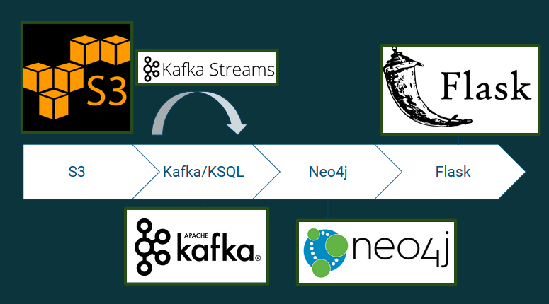

# Gamer Matchmaking: A Winning Team is a Good Team

[Live Demo](https://www.dataengproject.me)

In the online video game Dota 2, each match is a battle between 2 teams of 5 
players. However, many players do not actually play this game as a team; instead
 they're drafted along with other individuals by the game's matchmaking system. 

Video games have the unique problem that every time someone interacts with their
 service, there is a inherent chance for the user to lose. How do developers 
keep players engaged with their game? Traditionally, players are matched based 
on their skill level for balanced teams so even losses are fun experiences as 
opposed to frutrating ones. Under this system, the team for one match is not 
carried over to the other. This is a missed opportunity.

My project aims to reimagine matches as social interactions. Every match means 
a player has won with 4 other people and lost with 4 other people. These 
relationships can be represented as a property graph. Players can be matched 
based on their shared win rate with players they have played with before. This 
will help them build their own story when they engage with the game since 
they'll eventually learn the other player's playstyle, fostering teamwork while
also keeping them engaged with the game. 

## Overall Pipeline



1. Pull JSON match data from **S3** and produce each JSON message to **Kafka** with a Python producer
1. **Kafka streams** program transforms the data into a format useable by Neo4j ie. deriving player pairs
1. **Neo4j** reads the resulting Kafka topic and updates its database
1. My front-end website queries my database to matchmake teams using Python and **Dash**

## Kafka

I setup Kafka using <https://kafka.apache.org/quickstart>. I put specific instructions in the [kafka folder](./kafka)'s README.

## S3 to Kafka

**Location**: [kafka folder](./kafka)

**Purpose**: Downloads from S3 in chunks using GET requests and returns parseable JSON messages. 

**Info**: Uses python 3 and depends on boto3, json, and confluent-kafka libraries. Stream.py is the part that connects to S3 and drops irrelevant fields while producer.py produces the message to Kafka. The main method is send_data.py, which connects both of these classes. 

**Run Instructions**: You can run it by using the included Dockerfile. You'll need a config.py file with info like aws credentials and Kafka broker IP's; a template is included [here](./kafka/sample_config.py).

```shell
cd dataengproject/kafka
docker build -t send_data
docker run send_data
```
Or if you have the dependencies:
```shell
python3 send_data.py
```

## Kafka Streams

**Location**: [scala folder](./scala) 

**Purpose**: Consumes match data from the Kafka cluster and turns it into player pairs for each interaction like WON_WITH or HEALED, producing these into different topics. 

**Info**: Uses scala 2.12 and sbt to compile. 

**Run Instructions**: You can run it by using the included Dockerfile. Make sure to change the IP's for the bootstrap servers to the Kafka cluster by changing the property BOOTSTRAP in transform.scala.
 
```shell
cd dataengproject/scala
docker build -t transform
docker run transform
```
Or if you want to run it locally:
```shell
cd dataengproject/scala
sudo sbt ~run
```

## Neo4j

**Location**: [neo4j folder](./neo4j)

**Purpose**: Gets data from topics (node and relationship data) and stores it into the Neo4j database.

**Info**: Uses the Neo4j Kafka plugin (not Kafka Connect). This plugin works with Neo4j 3.5, and the plugin version I used was 3.5.5.

**Run Instructions**: You can run Neo4j using the [run.sh script](./neo4j/run.sh), which runs a Docker container in the foreground. It has the bolt protocol on port 7687 and the browser on port 7474. Install the plugin according to [these instructions](https://neo4j.com/docs/labs/neo4j-streams/current/introduction/#configuration_docker). You also need to configure the config file. There is a sample included [here](./neo4j/sample_neo4j.conf). When starting the neo4j database, I login to the browser and enter the [contraints](./neo4j/constraints.txt) to make indexes.

```shell
cd dataengproject/neo4j
./run.sh
```

## Website

**Location** [website folder](./website)

**Purpose** Front-end for matchmaking selected account id's

**Info**: Uses Dash to connect to Neo4j. 

**Run Instructions**: You can run this using the instructions [here](https://www.digitalocean.com/community/tutorials/how-to-serve-flask-applications-with-gunicorn-and-nginx-on-ubuntu-18-04). The commands are in the run.sh

```shell
cd dataengproject/website
sudo ./run.sh
```
